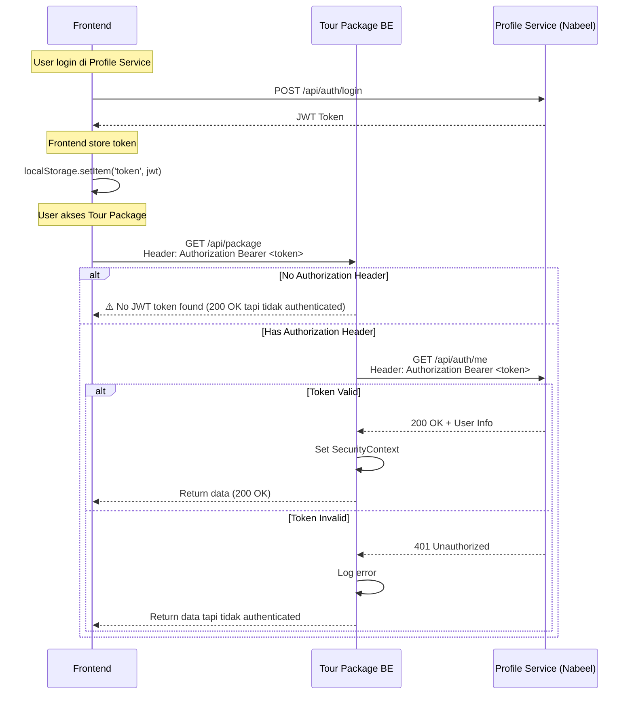

# Debugging JWT dengan Profile Service (Nabeel)

## 🔍 Issue yang Terjadi

Log menunjukkan:
```
⚠️  No JWT token found in request
```

Artinya **frontend tidak mengirim Authorization header** atau **header tidak sampai ke backend**.

---

## 📍 Profile Service Configuration

**Profile Service URL (Nabeel)**: `https://acc-be.beel.my.id/api/auth/me`

Hardcoded di: `JwtTokenFilter.java` line 35
```java
private final String AUTH_URL = "https://acc-be.beel.my.id/api/auth/me";
```

---

## 🧪 Test JWT Token dengan Profile Service

### 1. Get JWT Token dari Profile Service

Pertama, login dulu ke Profile Service untuk dapet JWT token:

```bash
# Login ke Profile Service Nabeel
curl -X POST https://acc-be.beel.my.id/api/auth/login \
  -H "Content-Type: application/json" \
  -d '{
    "username": "your-username",
    "password": "your-password"
  }'
```

**Expected Response:**
```json
{
  "token": "eyJhbGciOiJIUzI1NiIsInR5cCI6IkpXVCJ9...",
  "user": {
    "id": "user-id",
    "username": "your-username",
    "email": "your-email@example.com",
    "role": "Customer"
  }
}
```

Copy token dari response.

---

### 2. Test Validate Token ke Profile Service

```bash
# Replace YOUR_JWT_TOKEN dengan token dari step 1
export JWT_TOKEN="eyJhbGciOiJIUzI1NiIsInR5cCI6IkpXVCJ9..."

# Test validasi token ke Profile Service
curl -X GET https://acc-be.beel.my.id/api/auth/me \
  -H "Authorization: Bearer $JWT_TOKEN" \
  -v
```

**Expected Response (200 OK):**
```json
{
  "id": "user-id",
  "username": "your-username",
  "email": "your-email@example.com",
  "name": "Your Name",
  "role": "Customer"
}
```

**Jika gagal (401 Unauthorized):**
- Token invalid atau expired
- Profile Service tidak recognize token
- Header format salah

---

### 3. Test JWT Token ke Tour Package Service

```bash
# Test ke Tour Package API dengan token yang sama
curl -X GET https://your-tour-package-url.com/api/package \
  -H "Authorization: Bearer $JWT_TOKEN" \
  -v
```

**Expected:**
- Jika token valid: Return list packages (200 OK)
- Jika token invalid: 401 Unauthorized
- Jika **tidak ada header**: Log warning "No JWT token found"

---

## 🐛 Common Issues & Solutions

### Issue 1: "No JWT token found in request"

**Penyebab:**
- Frontend **tidak mengirim** header `Authorization: Bearer <token>`
- Header di-block oleh nginx/proxy/CORS
- Frontend request tanpa token (user belum login)

**Check di Frontend:**
```javascript
// Pastikan frontend mengirim header Authorization
fetch('https://tour-package-url.com/api/package', {
  headers: {
    'Authorization': `Bearer ${localStorage.getItem('token')}`,
    'Content-Type': 'application/json'
  }
})
```

**Check di Browser DevTools:**
1. Buka DevTools → Network tab
2. Click request ke backend
3. Lihat **Request Headers**
4. Pastikan ada: `Authorization: Bearer eyJhbGc...`

---

### Issue 2: Token Valid tapi Profile Service Return 401

**Penyebab:**
- Profile Service Nabeel sedang down/maintenance
- Token expired (check JWT expiration time)
- Profile Service URL salah

**Solution:**
```bash
# Test Profile Service health
curl https://acc-be.beel.my.id/api/auth/health

# atau
curl https://acc-be.beel.my.id/actuator/health
```

**Jika Profile Service down**, koordinasi dengan Nabeel untuk:
- Check service status
- Check database connection
- Check JWT secret configuration

---

### Issue 3: CORS Block Authorization Header

**Penyebab:**
Profile Service tidak allow `Authorization` header di CORS config.

**Check CORS di Profile Service (Nabeel harus set):**
```java
@Bean
public CorsConfigurationSource corsConfigurationSource() {
    CorsConfiguration configuration = new CorsConfiguration();
    configuration.setAllowedOrigins(Arrays.asList("https://tour-package-fe-url.com"));
    configuration.setAllowedMethods(Arrays.asList("GET", "POST", "PUT", "DELETE"));
    configuration.setAllowedHeaders(Arrays.asList("Authorization", "Content-Type")); // ✅ Must include Authorization
    configuration.setAllowCredentials(true);
    
    UrlBasedCorsConfigurationSource source = new UrlBasedCorsConfigurationSource();
    source.registerCorsConfiguration("/**", configuration);
    return source;
}
```

---

### Issue 4: Nginx/Ingress Strip Authorization Header

**Penyebab:**
Nginx/k3s Ingress configuration strip `Authorization` header.

**Check k3s Ingress:**
```bash
# Check ingress configuration
sudo k3s kubectl get ingress tourpackage-be -o yaml
```

**Pastikan tidak ada:**
```yaml
nginx.ingress.kubernetes.io/configuration-snippet: |
  proxy_set_header Authorization ""; # ❌ Don't do this!
```

**Should be:**
```yaml
nginx.ingress.kubernetes.io/configuration-snippet: |
  proxy_set_header Authorization $http_authorization; # ✅ Forward Authorization header
```

---

## 📊 Debug Flow



---

## 🔧 Troubleshooting Commands

### Check Tour Package Logs
```bash
# Kubernetes
sudo k3s kubectl logs -f deployment/tourpackage-be

# Docker
docker logs -f tourpackage-be

# Check last 100 lines
sudo k3s kubectl logs --tail=100 deployment/tourpackage-be | grep -E "JWT|Token|Authorization"
```

### Check Network from Tour Package to Profile Service
```bash
# Enter Tour Package pod
sudo k3s kubectl exec -it deployment/tourpackage-be -- /bin/sh

# Test connectivity to Profile Service
curl -I https://acc-be.beel.my.id/api/auth/me

# Test with token (inside pod)
curl -X GET https://acc-be.beel.my.id/api/auth/me \
  -H "Authorization: Bearer YOUR_TOKEN"
```

### Check Environment Variables
```bash
# Check if Profile Service URL is accessible from pod
sudo k3s kubectl exec deployment/tourpackage-be -- env | grep -i url
```

---

## ✅ Expected Behavior

When frontend sends valid JWT token:

**Backend Logs:**
```
📍 Request: GET /api/package
🔐 Validating JWT token with Profile Service
   Token (first 30 chars): eyJhbGciOiJIUzI1NiIsInR5cCI6...
✅ Token valid from Profile Service
👤 User Info:
   ID: user-123
   Email: user@example.com
   Username: username
   Name: User Name
   Role: Customer
🔑 Granted Authorities: [ROLE_Customer]
✅ Security context set successfully with AuthenticatedUser
```

---

## 📞 Koordinasi dengan Nabeel (Profile Service Owner)

**Yang perlu dikonfirmasi:**

1. **Profile Service URL**: Apakah `https://acc-be.beel.my.id/api/auth/me` masih aktif?

2. **JWT Token Format**: 
   - Algoritma: HS256 atau RS256?
   - Claims: apa saja yang ada di token? (id, username, email, role, dll)
   - Expiration: berapa lama token valid?

3. **CORS Configuration**: 
   - Apakah Profile Service allow request dari Tour Package BE URL?
   - Apakah `Authorization` header di-allow di CORS?

4. **API Response Format**:
   ```json
   {
     "id": "string",
     "username": "string",
     "email": "string",
     "name": "string",
     "role": "string"
   }
   ```

5. **Rate Limiting**: Apakah Profile Service ada rate limit untuk validation endpoint?

---

## 🚀 Quick Test Script

Save as `test-jwt.sh`:

```bash
#!/bin/bash

# Colors
RED='\033[0;31m'
GREEN='\033[0;32m'
YELLOW='\033[1;33m'
NC='\033[0m' # No Color

echo -e "${YELLOW}🧪 JWT Token Testing Script${NC}\n"

# Step 1: Login
echo -e "${YELLOW}Step 1: Login to Profile Service${NC}"
read -p "Username: " USERNAME
read -sp "Password: " PASSWORD
echo ""

LOGIN_RESPONSE=$(curl -s -X POST https://acc-be.beel.my.id/api/auth/login \
  -H "Content-Type: application/json" \
  -d "{\"username\":\"$USERNAME\",\"password\":\"$PASSWORD\"}")

TOKEN=$(echo $LOGIN_RESPONSE | jq -r '.token')

if [ "$TOKEN" == "null" ] || [ -z "$TOKEN" ]; then
    echo -e "${RED}❌ Login failed!${NC}"
    echo "Response: $LOGIN_RESPONSE"
    exit 1
fi

echo -e "${GREEN}✅ Login successful!${NC}"
echo "Token (first 50 chars): ${TOKEN:0:50}..."
echo ""

# Step 2: Validate token
echo -e "${YELLOW}Step 2: Validate token with Profile Service${NC}"
VALIDATE_RESPONSE=$(curl -s -w "\nHTTP_CODE:%{http_code}" -X GET https://acc-be.beel.my.id/api/auth/me \
  -H "Authorization: Bearer $TOKEN")

HTTP_CODE=$(echo "$VALIDATE_RESPONSE" | grep "HTTP_CODE" | cut -d: -f2)
BODY=$(echo "$VALIDATE_RESPONSE" | sed '/HTTP_CODE/d')

if [ "$HTTP_CODE" == "200" ]; then
    echo -e "${GREEN}✅ Token validation successful!${NC}"
    echo "User Info: $BODY"
else
    echo -e "${RED}❌ Token validation failed! (HTTP $HTTP_CODE)${NC}"
    echo "Response: $BODY"
    exit 1
fi
echo ""

# Step 3: Test Tour Package API
echo -e "${YELLOW}Step 3: Test Tour Package API${NC}"
read -p "Tour Package URL (e.g., https://tour-package.com): " TOUR_URL

TOUR_RESPONSE=$(curl -s -w "\nHTTP_CODE:%{http_code}" -X GET "$TOUR_URL/api/package" \
  -H "Authorization: Bearer $TOKEN")

HTTP_CODE=$(echo "$TOUR_RESPONSE" | grep "HTTP_CODE" | cut -d: -f2)
BODY=$(echo "$TOUR_RESPONSE" | sed '/HTTP_CODE/d')

if [ "$HTTP_CODE" == "200" ]; then
    echo -e "${GREEN}✅ Tour Package API successful!${NC}"
else
    echo -e "${RED}❌ Tour Package API failed! (HTTP $HTTP_CODE)${NC}"
    echo "Response: $BODY"
fi

echo -e "\n${GREEN}✅ Testing complete!${NC}"
```

**Usage:**
```bash
chmod +x test-jwt.sh
./test-jwt.sh
```

---

**Created**: November 30, 2025  
**Issue**: JWT token not sent from frontend or CORS/Profile Service issue  
**Status**: ⚠️ Need to check with Nabeel (Profile Service owner)
