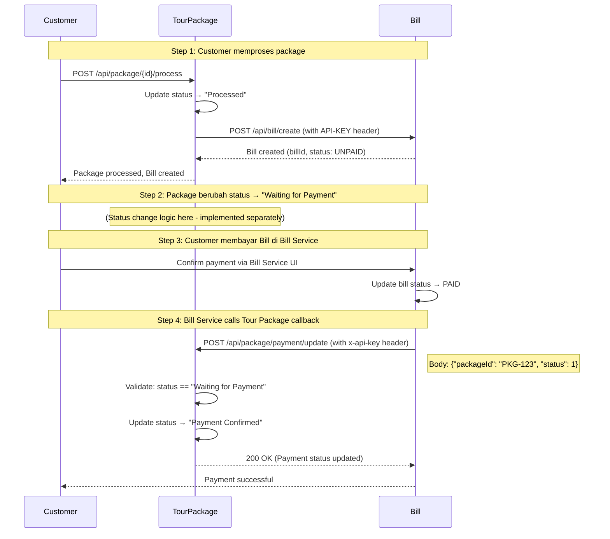

# Payment Callback API - Tour Package Service

Endpoint ini dipanggil oleh **Bill Service** ketika pembayaran telah dikonfirmasi.

## 📍 Endpoint

```
POST /api/package/payment/update
```

## 🔐 Authentication

**API Key Authentication** (Microservice-to-Microservice)

Bill Service harus mengirim API Key di header:

```http
x-api-key: NlfUxKNkXIwORhKZCbbYevFecxRCFttNnycTS
```

⚠️ **PENTING**: 
- Endpoint ini **HANYA** untuk Bill Service
- **TIDAK** menggunakan JWT authentication
- Frontend **TIDAK BOLEH** memanggil endpoint ini

## 📥 Request

### Headers
```http
Content-Type: application/json
x-api-key: NlfUxKNkXIwORhKZCbbYevFecxRCFttNnycTS
```

### Body
```json
{
  "packageId": "PKG-20251130-001",
  "status": 1
}
```

### Field Descriptions

| Field | Type | Required | Description |
|-------|------|----------|-------------|
| `packageId` | String | ✅ | ID package yang dibayar (service_reference_id dari Bill) |
| `status` | Integer | ✅ | Status pembayaran dari Bill Service. Values: `0` = UNPAID, `1` = PAID |

## 📤 Response

### Success Response (200 OK)
```json
{
  "status": 200,
  "message": "Payment status updated successfully",
  "timestamp": "2025-11-30T12:45:00.000+07:00",
  "data": {
    "id": "PKG-20251130-001",
    "userId": "f5dad850-118b-4bb5-a3c5-0c1e2fa84f16",
    "packageName": "Bali Holiday Package",
    "status": "Payment Confirmed",
    "price": 5000000,
    ...
  }
}
```

### Error Responses

#### 401 Unauthorized - Missing/Invalid API Key
```json
{
  "error": "Unauthorized",
  "message": "API Key is required"
}
```

#### 400 Bad Request - Invalid Package Status
```json
{
  "status": 400,
  "message": "Cannot update payment status. Package current status is 'Processed', expected 'Waiting for Payment'",
  "timestamp": "2025-11-30T12:45:00.000+07:00",
  "data": null
}
```

#### 400 Bad Request - Invalid Payment Status
```json
{
  "status": 400,
  "message": "Invalid payment status: 2. Expected: 0 (UNPAID) or 1 (PAID).",
  "timestamp": "2025-11-30T12:45:00.000+07:00",
  "data": null
}
```

#### 400 Bad Request - Bill Still Unpaid
```json
{
  "status": 400,
  "message": "Cannot confirm payment. Bill status is still UNPAID (0).",
  "timestamp": "2025-11-30T12:45:00.000+07:00",
  "data": null
}
```

#### 400 Bad Request - Package Not Found
```json
{
  "status": 400,
  "message": "Package not found with id: PKG-INVALID",
  "timestamp": "2025-11-30T12:45:00.000+07:00",
  "data": null
}
```

## 🔄 Status Transition Flow

```
"Waiting for Payment" → (Bill Service calls /payment/update with status=1) → "Payment Confirmed"
```

**Bill Service Status Codes:**
- `0` = UNPAID
- `1` = PAID

**Validations:**
- ✅ Package must exist
- ✅ Package status must be exactly `"Waiting for Payment"`
- ✅ Payment status must be `1` (PAID)
- ✅ API Key must be valid

## 💻 Example cURL Request

```bash
curl -X POST http://localhost:8080/api/package/payment/update \
  -H "Content-Type: application/json" \
  -H "x-api-key: NlfUxKNkXIwORhKZCbbYevFecxRCFttNnycTS" \
  -d '{
    "packageId": "PKG-20251130-001",
    "status": 1
  }'
```

## 🔧 Configuration

### Tour Package Service `.env`

```properties
# Bill Service → Tour Package (Payment Callback)
API_KEY_BILL_SERVICE=NlfUxKNkXIwORhKZCbbYevFecxRCFttNnycTS
```

### Bill Service Configuration

Bill Service harus menggunakan:
- **URL**: `http://localhost:8080/api/package/payment/update` (atau production URL)
- **API Key**: `NlfUxKNkXIwORhKZCbbYevFecxRCFttNnycTS`
- **Header**: `x-api-key` (lowercase, dengan dash)

## 📊 Integration Flow



## ⚠️ Important Notes

1. **Status Dependency**: Package harus dalam status `"Waiting for Payment"` untuk bisa di-update
2. **One-Way Update**: Hanya mendukung status `"PAID"`, tidak ada rollback atau cancel payment
3. **Idempotency**: Jika dipanggil multiple times dengan data sama, akan return error jika status sudah `"Payment Confirmed"`
4. **Security**: API Key validation dilakukan di `ApiKeyFilter` sebelum request masuk ke controller

## 🧪 Testing

### Manual Test with cURL

```bash
# 1. Set package status to "Waiting for Payment" terlebih dahulu
# (This is done automatically after bill creation in some flows)

# 2. Call payment update endpoint
curl -X POST http://localhost:8080/api/package/payment/update \
  -H "Content-Type: application/json" \
  -H "x-api-key: NlfUxKNkXIwORhKZCbbYevFecxRCFttNnycTS" \
  -d '{
    "packageId": "PKG-20251130-001",
    "status": 1
  }'

# 3. Verify package status changed to "Payment Confirmed"
curl http://localhost:8080/api/package/PKG-20251130-001 \
  -H "Authorization: Bearer YOUR_JWT_TOKEN"
```

### Test Invalid API Key

```bash
curl -X POST http://localhost:8080/api/package/payment/update \
  -H "Content-Type: application/json" \
  -H "x-api-key: invalid-key" \
  -d '{
    "packageId": "PKG-20251130-001",
    "status": 1
  }'

# Expected: 401 Unauthorized
```

### Test Invalid Status (Not 0 or 1)

```bash
curl -X POST http://localhost:8080/api/package/payment/update \
  -H "Content-Type: application/json" \
  -H "x-api-key: NlfUxKNkXIwORhKZCbbYevFecxRCFttNnycTS" \
  -d '{
    "packageId": "PKG-20251130-001",
    "status": 99
  }'

# Expected: 400 Bad Request - "Invalid payment status: 99. Expected: 0 (UNPAID) or 1 (PAID)."
```

## 📝 Implementation Reference

- **Controller**: `PackageRestController.java` → `updatePaymentStatus()`
- **Service**: `TourPackageRestServiceImpl.java` → `updatePaymentStatus()`
- **Security Filter**: `ApiKeyFilter.java`
- **DTO**: `UpdatePaymentStatusRequestDTO.java`

---

**Last Updated**: November 30, 2025  
**Version**: 1.0
