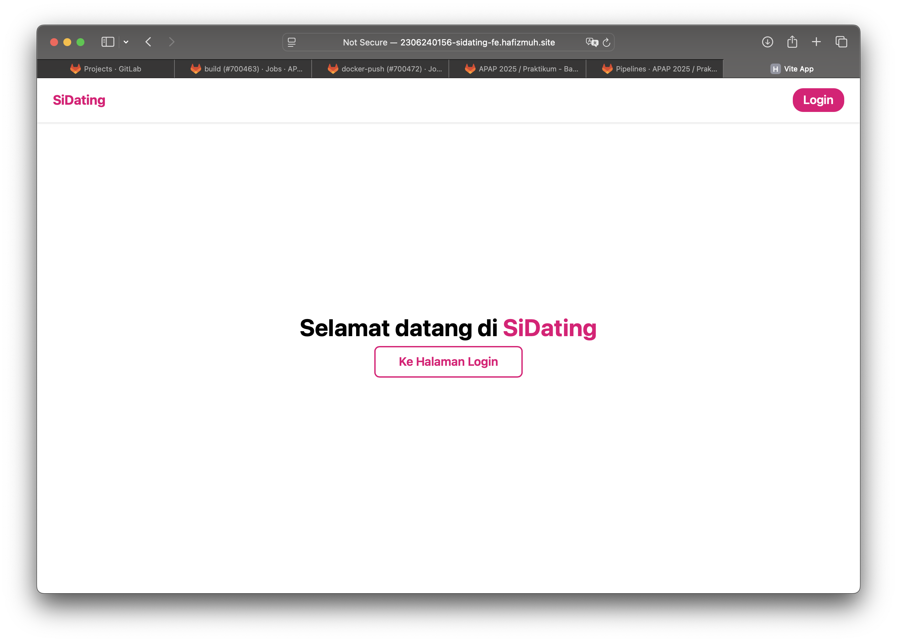
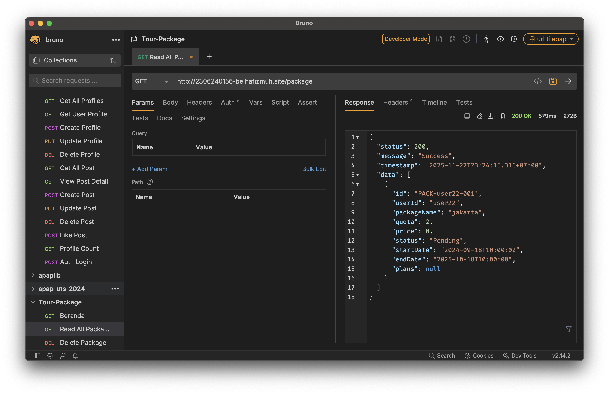
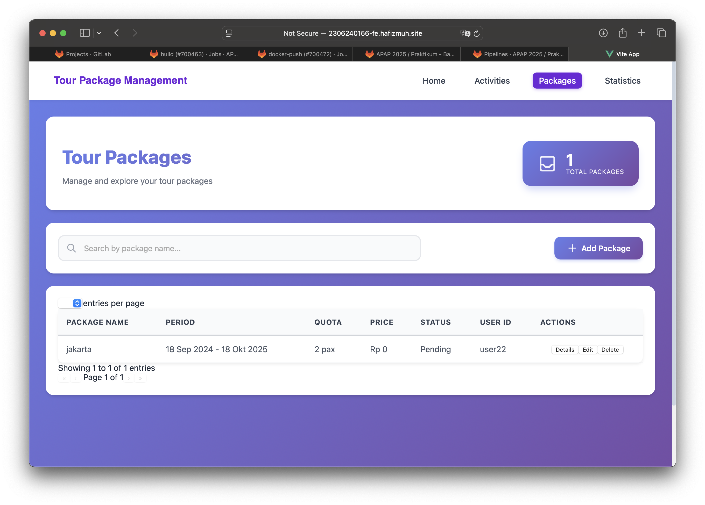

# Tour Package Backend API - Complete Documentation

## 🎯 Quick Navigation

### 📚 **NEW: Payment Methods & Transactions Documentation**

#### **🚀 START HERE:**
1. **[QUICK-START.md](QUICK-START.md)** ⭐⭐⭐ - Ultra-quick overview (5 min read)
2. **[FRONTEND-IMPLEMENTATION-CHECKLIST.md](FRONTEND-IMPLEMENTATION-CHECKLIST.md)** ⭐⭐ - Step-by-step checklist with checkboxes
3. **[DOCUMENTATION-INDEX.md](DOCUMENTATION-INDEX.md)** ⭐ - Complete index of all documentation files

#### **For Frontend Developers:**
1. **[NAVBAR-INTEGRATION.md](NAVBAR-INTEGRATION.md)** ⭐ - Quick guide to add navbar items
2. **[SUPERADMIN-REQUIREMENTS.md](SUPERADMIN-REQUIREMENTS.md)** - Requirements breakdown with examples
3. **[Payment Methods Guide](bruno-tests/Payment-Methods/FRONTEND-INTEGRATION-GUIDE.md)** - Complete implementation guide with code examples
4. **[Transactions Guide](bruno-tests/Top-Up-Transactions/FRONTEND-INTEGRATION-GUIDE.md)** - Complete implementation guide with code examples

#### **For Understanding the System:**
- **[PAYMENT-METHODS-TRANSACTIONS-README.md](PAYMENT-METHODS-TRANSACTIONS-README.md)** - Complete overview & features
- **[SYSTEM-ARCHITECTURE.md](SYSTEM-ARCHITECTURE.md)** - System diagrams & architecture

#### **For API Testing:**
- **[bruno-tests/Payment-Methods/](bruno-tests/Payment-Methods/)** - Payment Methods API tests
- **[bruno-tests/Top-Up-Transactions/](bruno-tests/Top-Up-Transactions/)** - Transactions API tests

---

## 🚀 Quick Start - Payment Methods & Transactions

### Backend (Already Running)
```bash
./gradlew bootRun
# Server: http://localhost:8080
```

### Frontend Implementation (3 Steps):
1. **Read** `NAVBAR-INTEGRATION.md` (5 minutes)
2. **Add** navbar menu items based on user role
3. **Create** pages using code examples in FRONTEND-INTEGRATION-GUIDE files

### API Endpoints Summary:
```
# Payment Methods (Superadmin)
GET    /api/payment-methods
POST   /api/payment-methods
PUT    /api/payment-methods/{id}/status
DELETE /api/payment-methods/{id}

# Transactions (Customer + Superadmin)
GET    /api/transactions
POST   /api/transactions              (Customer only)
PUT    /api/transactions/{id}/status  (Superadmin only)
DELETE /api/transactions/{id}         (Superadmin only)
```

---

## 📚 Authentication Documentation

**Important:** This project uses Nabeel's SSO authentication with OTT Exchange pattern.

**Documentation:**
- 🔥 **[Backend Auth API](./bruno-tests/Auth/README.md)** - OTT exchange endpoint, JWT payload structure, testing guide
- 🔥 **[Frontend Auth Flow Guide](../tour-package-2306240156-fe/AUTH-FLOW-SYNC-GUIDE.md)** - Complete 13-step authentication flow with diagrams
- 🧪 **[Frontend Testing Guide](../tour-package-2306240156-fe/LOGIN-TEST-GUIDE.md)** - Step-by-step manual testing
- 📝 **[Auth Implementation Summary](./AUTH-IMPLEMENTATION-SUMMARY.md)** - Backend authentication implementation details

---

## 📦 Main Features

### For **Superadmin**:
- ✅ Manage Payment Methods (Create, Read, Update Status, Delete)
- ✅ View All Transactions from all customers
- ✅ Approve/Reject Top-Up Requests (automatic balance update)
- ✅ Delete Transactions

### For **Customer**:
- ✅ Create Top-Up Requests (with payment method & proof)
- ✅ View Own Transactions only
- ✅ Select from Active Payment Methods

---

## 🔐 Authentication

All API calls require JWT token:
```javascript
headers: {
  'Authorization': `Bearer ${jwt_token}`
}
```

Get JWT by exchanging OTT:
```bash
POST /api/auth/exchange
{ "ott": "your-ott-here" }
```

---

# Dokumentasi Deployment CI/CD

**Key Points:**
- Backend returns `{ data: { jwt: "..." } }` NOT `{ data: { token: "..." } }`
- Frontend stores JWT in localStorage with key `"token"`
- All API calls include `Authorization: Bearer <JWT>` header
- OTT is single-use and expires in ~30 seconds

---

## Daftar Isi
- [1. Screenshot Deployment](#1-screenshot-deployment)
- [2. Pipeline CI/CD Spring Boot](#2-pipeline-cicd-spring-boot)
- [3. Pipeline CI/CD Improvement](#3-pipeline-cicd-improvement)
- [4. Elastic IP pada EC2](#4-elastic-ip-pada-ec2)
- [5. Perbedaan Docker dan Kubernetes](#5-perbedaan-docker-dan-kubernetes)
- [6. Proses Terpenting dalam Pipeline](#6-proses-terpenting-dalam-pipeline)
- [7. Konfigurasi Kubernetes (5 File)](#7-konfigurasi-kubernetes-5-file)
- [8. Start on Restart](#8-start-on-restart)
- [9. Keuntungan Kubernetes](#9-keuntungan-kubernetes)
- [10. Tipe Service Kubernetes](#10-tipe-service-kubernetes)
- [11. Pelajaran dan Penerapan CI/CD](#11-pelajaran-dan-penerapan-cicd)

Saya juga melakukan deployment melalui github, berikut link repository github saya:
- TI BE: https://github.com/valizanady/TI-BE-APAP-2306240156.git 
- TI FE: https://github.com/valizanady/TI-FE-APAP-2306240156.git 

---

## 1. Screenshot Deployment

### Sidating BE1


### Sidating BE2


### Sidating FE



### Tugas Individu - Backend (Spring Boot)


**URL Backend:** http://2306240156-be.hafizmuh.site/


### Tugas Individu - Frontend


**URL Frontend:** http://2306240156-fe.hafizmuh.site/


## 2. Pipeline CI/CD Spring Boot

### Diagram Pipeline


**Deskripsi :**
Pipeline CI/CD ini menggambarkan alur deployment aplikasi Spring Boot yang terdiri dari beberapa tahapan terintegrasi. Proses dimulai dari fase Development di mana developer melakukan coding, commit perubahan, dan push ke repository GitLab. Setelah kode di-push, GitLab Runner akan otomatis terpicu untuk menjalankan pipeline CI/CD. Tahap pertama dalam GitLab adalah Build, di mana aplikasi Spring Boot dikompilasi dan di-package menjadi artifact seperti JARfile. Setelah build berhasil, proses dilanjutkan ke tahap Containerize yang membungkus aplikasi ke dalam Docker image menggunakan Dockerfile. Docker image yang telah dibuat kemudian di-push ke DockerHub yang berfungsi sebagai registry penyimpanan image dengan versioning yang jelas. Dari DockerHub, server AWS EC2 akan menarik image terbaru dan melakukan deployment menggunakan K3s (lightweight Kubernetes). Setelah proses Deploy K3s selesai, aplikasi akan berstatus Deployed dan siap diakses oleh pengguna. Seluruh alur ini berjalan otomatis setiap kali ada perubahan kode yang di-push ke repository, memastikan deployment yang cepat dan konsisten.


## 3. Pipeline CI/CD Improvement

### Diagram Pipeline Improvement


**Deskripsi :** 
Pipeline yang telah diperbaiki menambahkan stage Testing yang sangat krusial untuk meningkatkan kualitas deployment. Improvement utama terletak pada penambahan tahap Test yang diposisikan setelah Build dan sebelum Containerize. Pada tahap Test ini, pipeline akan menjalankan berbagai automated testing seperti unit tests untuk memvalidasi fungsi-fungsi individual, integration tests untuk memastikan komponen aplikasi bekerja harmonis, serta code quality checks menggunakan tools seperti SonarQube untuk menganalisis kualitas kode dan code coverage. Penambahan tahap testing ini memberikan banyak manfaat, antara lain deteksi bug lebih awal sebelum masuk ke tahap containerization sehingga menghemat waktu dan biaya, memastikan setiap build memenuhi standar kualitas yang ditetapkan, serta mencegah deployment kode yang bermasalah ke production karena pipeline akan otomatis berhenti jika tests gagal. Dengan improvement ini, pipeline menjadi lebih robust dan reliable, menerapkan quality gates yang ketat, dan membangun budaya quality-first dalam development cycle. Hasilnya adalah pengurangan signifikan risiko downtime atau bugs di production environment, serta peningkatan kepercayaan tim terhadap setiap deployment yang dilakukan.

## 4. Elastic IP pada EC2

### Alasan Penggunaan Elastic IP

Pengaitan EC2 instance dengan Elastic IP sangat penting untuk menjaga stabilitas akses aplikasi yang di-deploy. Elastic IP berfungsi sebagai alamat IP publik yang bersifat statis dan tetap melekat pada instance kita selama kita tidak melepaskannya. Ketika kita mengalokasikan Elastic IP, AWS akan mereservasi alamat IP tersebut khusus untuk akun kita sehingga tidak akan digunakan oleh pengguna lain. Hal ini memberikan kepastian bahwa instance kita akan selalu dapat diakses melalui alamat IP yang sama, bahkan ketika instance di-stop dan di-start kembali. Tanpa Elastic IP, setiap kali kita melakukan restart environment AWS Academy atau menghentikan lalu menjalankan kembali instance, AWS akan mengalokasikan IP publik yang berbeda secara otomatis. Kondisi ini akan menyebabkan masalah serius pada konfigurasi domain karena DNS mapping yang sudah kita setup akan mengarah ke IP lama yang tidak valid lagi, sehingga aplikasi tidak dapat diakses melalui domain yang telah dikonfigurasi. Pengguna akan kesulitan mengakses aplikasi karena harus terus-menerus mengupdate DNS record setiap kali IP berubah, yang tentu saja tidak praktis dan tidak profesional untuK production.

## 5. Perbedaan Docker dan Kubernetes

Docker dan Kubernetes memiliki peran yang berbeda namun saling melengkapi dalam pipeline deployment praktikum ini. Docker berperan sebagai platform containerization yang bertanggung jawab untuk mengemas aplikasi beserta seluruh dependensinya ke dalam sebuah container image yang portable dan konsisten. Dengan Docker, kita dapat memastikan bahwa aplikasi yang berjalan di mesin development akan berjalan dengan cara yang sama persis di server production, menghilangkan masalah "works on my machine". Docker image yang dibuat menjadi unit deployment yang self-contained, mencakup kode aplikasi, runtime environment, libraries, dan konfigurasi sistem yang dibutuhkan. Di sisi lain, Kubernetes dalam bentuk K3s berfungsi sebagai container orchestrator yang mengatur dan mengelola lifecycle dari container-container tersebut di lingkungan production. Kubernetes tidak membuat container, melainkan mengambil container image yang sudah dibuat Docker lalu menjalankannya dengan berbagai fitur enterprise seperti automatic scaling, self-healing ketika container crash, load balancing antar pod, rolling updates tanpa downtime, serta service discovery untuk komunikasi antar komponen. Kubernetes juga mengelola resource allocation, networking, dan storage untuk memastikan aplikasi berjalan optimal dan highly available. Singkatnya, Docker adalah tool untuk membuat dan packaging aplikasi, sedangkan Kubernetes adalah platform untuk menjalankan dan mengelola aplikasi tersebut secara reliable di production environment.

## 6. Proses Terpenting dalam Pipeline

Dari keseluruhan rangkaian proses dalam pipeline CI/CD, tahap deployment merupakan fase paling krusial yang menentukan keberhasilan seluruh alur deployment. Meskipun tahap build dan push image ke Docker Hub berjalan dengan sempurna, aplikasi tetap tidak akan dapat diakses jika terjadi kesalahan pada tahap deployment. Pada fase ini, berbagai komponen Kubernetes seperti Secret, ConfigMap, Service, dan Ingress harus dikonfigurasi dengan tepat agar aplikasi dapat berjalan sesuai ekspektasi. Kesalahan kecil dalam konfigurasi environment secrets variable, misalnya salah mengetik nilai DATABASE_PASSWORD atau CORS_ALLOWED_ORIGINS, dapat membuat aplikasi gagal terkoneksi ke database atau menolak request dari frontend. Begitu juga dengan konfigurasi Ingress, jika hostname atau path routing tidak sesuai dengan DNS yang telah di-setup, traffic dari internet tidak akan sampai ke pod aplikasi meskipun pod tersebut sudah running dengan baik. Tahap deployment juga melibatkan proses pulling image dari registry, creating atau updating pods, serta memastikan semua resource Kubernetes ter-apply dengan benar di cluster. Jika proses kubectl apply gagal karena syntax error di file YAML atau permission issue, seluruh deployment akan terhenti. Oleh karena itu, tahap deployment memiliki dampak paling besar terhadap user experience karena di sinilah aplikasi benar-benar live dan accessible melalui URL production. Semua usaha di tahap sebelumnya akan sia-sia jika deployment tidak dilakukan dengan teliti dan konfigurasi yang akurat.  Terutama variable BE_URL pada backend yang harus mengarah ke URL production yang benar, karena jika variable ini tidak tepat atau masih mengarah ke localhost, frontend tidak akan bisa berkomunikasi dengan backend API dengan baik dan aplikasi akan mengalami error saat melakukan request data. Semua usaha di tahap sebelumnya akan sia-sia jika deployment tidak dilakukan dengan teliti dan konfigurasi yang akurat, terutama untuk variable-variable yang mengatur koneksi antar services.

## 7. Konfigurasi Kubernetes (5 File)

Dalam praktikum ini, deployment aplikasi ke Kubernetes menggunakan lima file konfigurasi yang masing-masing memiliki fungsi spesifik dalam mengatur bagaimana aplikasi berjalan di cluster.

File deployment.yaml merupakan file konfigurasi utama yang mendefinisikan bagaimana container aplikasi akan di-deploy dan dijalankan di cluster Kubernetes. File ini menentukan Docker image mana yang akan digunakan, berapa jumlah replica pod yang harus running untuk high availability, port mana yang akan dibuka di container, serta bagaimana environment variables diinject ke dalam pod dari ConfigMap dan Secret. Kubernetes menggunakan spesifikasi dalam file ini untuk membuat objek Deployment yang akan mengelola seluruh lifecycle pod, termasuk proses update, rollback, dan self-healing jika ada pod yang crash.

File service.yaml berfungsi mendefinisikan objek Service yang memberikan endpoint stabil untuk mengakses pod-pod aplikasi di dalam cluster. Karena pod bersifat ephemeral dan dapat berganti nama atau IP setiap kali restart atau rolling update, Service memberikan abstraksi dengan menyediakan satu nama DNS dan port yang konsisten. Service akan secara otomatis melakukan load balancing ke semua pod yang sehat di backend, sehingga traffic didistribusikan merata dan aplikasi tetap dapat diakses meskipun pod individual mengalami restart.

File ingress.yaml mengatur bagaimana traffic HTTP/HTTPS dari internet akan diarahkan masuk ke dalam cluster Kubernetes dan diteruskan ke Service yang tepat. Dalam file ini kita mendefinisikan hostname atau domain yang akan digunakan untuk mengakses aplikasi (misalnya 2306240156-be.hafizmuh.site), serta routing rules yang menentukan path mana yang akan dikirim ke Service mana. Ingress bertindak sebagai entry point dan reverse proxy yang mengelola external access ke aplikasi di cluster, sehingga kita tidak perlu expose Service secara langsung ke public.

File secret.yaml dibuat secara otomatis di pipeline GitLab CI/CD dan berfungsi menyimpan data konfigurasi yang bersifat sensitif seperti password database, API keys, atau credentials lainnya. Value dalam Secret disimpan dalam format base64 encoding dan diinject ke pod sebagai environment variable saat runtime. Dengan menggunakan Secret, informasi sensitif tidak perlu di-hardcode di kode aplikasi atau di-commit ke repository, sehingga meningkatkan keamanan aplikasi secara signifikan.

File config.yaml juga dibuat otomatis di pipeline dan berfungsi menyimpan konfigurasi aplikasi yang tidak sensitif seperti database URL, username, atau parameter aplikasi lainnya. Berbeda dengan Secret, ConfigMap tidak dienkripsi dan ditujukan untuk data konfigurasi biasa yang perlu dipisahkan dari kode aplikasi. Dengan ConfigMap, kita dapat mengubah konfigurasi aplikasi tanpa perlu rebuild Docker image, cukup dengan mengupdate ConfigMap dan restart pod.

## 8. Start on Restart

Sistem automatic restart diterapkan melalui dua mekanisme berbeda untuk memastikan seluruh layanan tetap berjalan setelah server EC2 di-restart. Untuk layer infrastruktur dasar, kita menggunakan systemd untuk mengelola Docker daemon dengan menjalankan perintah sudo systemctl enable docker yang membuat Docker service otomatis start saat boot, dilanjutkan dengan sudo systemctl start docker untuk menjalankan service tersebut. Khusus untuk container database PostgreSQL, kita menambahkan restart policy dengan perintah docker update --restart=always <nama_container>, yang menginstruksikan Docker untuk selalu menjalankan ulang container ini setiap kali Docker daemon start atau container mengalami crash. Kombinasi ketiga command ini memastikan bahwa setelah EC2 instance di-restart, Docker service akan otomatis aktif dan container database akan ikut running tanpa intervensi manual. 

Untuk aplikasi yang di-deploy menggunakan Kubernetes, mekanisme restart bekerja secara berbeda namun lebih powerful. Kubernetes memiliki built-in self-healing mechanism yang secara default memastikan jumlah pod yang running selalu sesuai dengan jumlah replica yang didefinisikan di deployment.yaml. Controller manager di Kubernetes terus-menerus memonitor state dari semua pod, dan jika mendeteksi ada pod yang mati atau node yang restart, secara otomatis akan membuat pod baru untuk menggantikannya hingga desired state tercapai kembali. Ketika EC2 instance mati lalu hidup kembali, K3s service (yang juga di-enable via systemd) akan otomatis start, kemudian Kubernetes akan melakukan reconciliation untuk memastikan semua pod aplikasi backend dan frontend kembali running sesuai spesifikasi. Mekanisme ini jauh lebih robust dibanding manual docker run karena Kubernetes tidak hanya restart container, tetapi juga memverifikasi health check dan memastikan seluruh networking serta storage ter-attach dengan benar sebelum menganggap pod dalam kondisi ready.

## 9. Keuntungan Kubernetes

Menggunakan Kubernetes untuk deployment memberikan berbagai keuntungan signifikan dibandingkan dengan pendekatan tradisional menjalankan container secara manual menggunakan docker run.

Infrastructure as Code: Kubernetes menggunakan pendekatan deklaratif melalui file YAML configuration seperti deployment, service, dan ingress yang membuat seluruh infrastructure menjadi terstruktur dan terdokumentasi dengan baik. Dengan konfigurasi berbentuk file, kita dapat melakukan version control menggunakan Git, melakukan code review sebelum deployment, serta dengan mudah melakukan rollback ke versi sebelumnya jika terjadi masalah.
Self-Healing Mechanism: Kubernetes menyediakan fitur self-healing yang sangat valuable untuk production environment. Ketika sebuah container mengalami crash karena bug atau memory issue, Kubernetes akan secara otomatis mendeteksi kegagalan tersebut melalui health check dan liveness probe, kemudian membuat pod replacement baru untuk menggantikan pod yang bermasalah tanpa manual intervention.
Scaling dan Rolling Updates: Kubernetes memungkinkan horizontal scaling dengan mudah melalui perubahan jumlah replica di deployment spec, dan Kubernetes akan handle process creating dan load balancing ke pod-pod baru tersebut. Rolling updates memungkinkan deployment versi baru aplikasi tanpa menyebabkan downtime, karena Kubernetes akan secara bertahap mengganti pod lama dengan pod baru sambil memastikan selalu ada minimum pod yang healthy melayani traffic.

Networking dan Service Discovery: Service object memberikan stable endpoint untuk berkomunikasi antar pod, meskipun pod-pod tersebut constantly berubah IP address karena restart atau scaling. Ingress controller mengelola external traffic routing dengan fitur-fitur seperti SSL termination, path-based routing, dan virtual hosting dalam satu konfigurasi terpusat, berbeda dengan docker run manual yang memerlukan konfigurasi port mapping dan reverse proxy secara terpisah.

Integrasi CI/CD yang Seamless: Pipeline GitLab CI cukup melakukan build image baru, push ke registry dengan tag yang di-update, lalu menjalankan kubectl apply atau kubectl set image, dan Kubernetes akan mengambil alih seluruh proses deployment dengan rolling update strategy yang aman. Dalam praktikum ini, penggunaan Kubernetes menjadikan deployment process lebih professional, scalable, dan mendekati best practices yang digunakan di industry untuk production-grade applications.

## 10. Tipe Service Kubernetes
Kubernetes menyediakan tiga tipe Service utama yang masing-masing dirancang untuk use case berbeda dalam mengekspos aplikasi.

ClusterIP: Tipe Service default yang hanya dapat diakses dari dalam cluster Kubernetes internal network. Service ini menciptakan virtual IP yang stabil di dalam cluster yang dapat digunakan oleh pod-pod lain untuk berkomunikasi dengan pods di backend Service tersebut. ClusterIP sangat cocok untuk komunikasi internal antar microservices atau komponen aplikasi yang tidak perlu diakses dari luar cluster, dengan keuntungan kesederhanaan dan keamanan karena tidak ada port yang terbuka ke public network.

NodePort: Tipe Service yang membuka static port pada setiap worker node di cluster, sehingga Service dapat diakses dari luar cluster melalui kombinasi <IP-node>:<NodePort>. Kubernetes akan mengalokasikan port dalam range 30000-32767 pada semua nodes dan meneruskan traffic yang masuk ke port tersebut ke pods di backend. NodePort berguna untuk development environment atau small-scale deployment, namun kelemahannya adalah managing banyak NodePort services bisa menjadi kompleks dan tidak ideal untuk production security.

LoadBalancer: Tipe Service yang request cloud provider (seperti AWS, GCP, atau Azure) untuk provision external load balancer yang secara otomatis route traffic dari internet ke nodes di cluster. Service ini adalah cara standard untuk expose production application di cloud environment karena memberikan single, stable entry point dengan automatic health checking dan traffic distribution, namun memiliki cost untuk setiap LoadBalancer yang dibuat.

Alasan Menggunakan ClusterIP: Dalam praktikum ini, ClusterIP dipilih sebagai tipe Service yang paling appropriate karena akses dari external traffic sudah ditangani secara terpusat oleh Ingress controller yang merupakan built-in feature dari K3s. Ingress bertindak sebagai single entry point yang menerima HTTP/HTTPS traffic dari internet, melakukan routing based on hostname dan path, lalu meneruskan traffic ke ClusterIP Service yang appropriate di backend. Dengan arsitektur ini, application pods tidak perlu exposed directly ke public network, membuat konfigurasi lebih clean dan maintainable, serta cost-effective untuk environment praktikum. Setup ini merepresentasikan production-ready architecture yang secure, scalable, dan efficient.

## 11. Pelajaran dan Penerapan CI/CD

Pelajaran terpenting yang saya peroleh dari proses deployment otomatis ini adalah pemahaman mendalam tentang bagaimana automation dapat secara dramatis meningkatkan efisiensi dan reliability dalam software development lifecycle.

- Eliminasi Human Error: Sebelum menerapkan CI/CD, deployment manual melibatkan serangkaian langkah repetitif yang error-prone seperti build aplikasi secara lokal, create Docker image, push ke registry, SSH ke server, dan berbagai konfigurasi manual lainnya. Dengan implementasi CI/CD pipeline, seluruh proses dari code commit hingga production deployment terotomasi dalam satu workflow yang konsisten dan repeatable, mengeliminasi variability dan human error dari deployment process.

- Faster Feedback Loop: Automasi ini tidak hanya menghemat waktu yang signifikan, tetapi lebih penting lagi memungkinkan developer untuk focus pada writing code dan implementing features, bukan dealing dengan deployment complexity. Feedback loop juga menjadi lebih cepat karena developer langsung mendapat notifikasi jika build atau deployment gagal, allowing quick identification dan fixing of issues.

- Aplikasi Luas CI/CD: Konsep CI/CD yang dipelajari memiliki aplikasi yang sangat luas dan dapat diterapkan pada berbagai jenis proyek software development. Untuk proyek web application, pipeline dapat diadaptasi dengan menambahkan testing stages seperti unit tests, integration tests, dan end-to-end tests. Proyek mobile application development dapat menggunakan CI/CD untuk automated building dan distribution, bahkan data science projects dapat menggunakannya untuk automate model training dan deployment.

- Key Principles: Principles yang applicable across projects meliputi version control semua code dan configuration files, automate repetitive tasks, implement automated testing di pipeline, use declarative configuration (Infrastructure as Code), dan implement monitoring serta logging. Dengan menerapkan principles ini, development team dapat deliver features faster, dengan higher quality, dan lower risk of production incidents. CI/CD bukan hanya tentang technology atau tools, tetapi lebih tentang culture of automation, collaboration, dan continuous improvement yang essential untuk modern software development.


